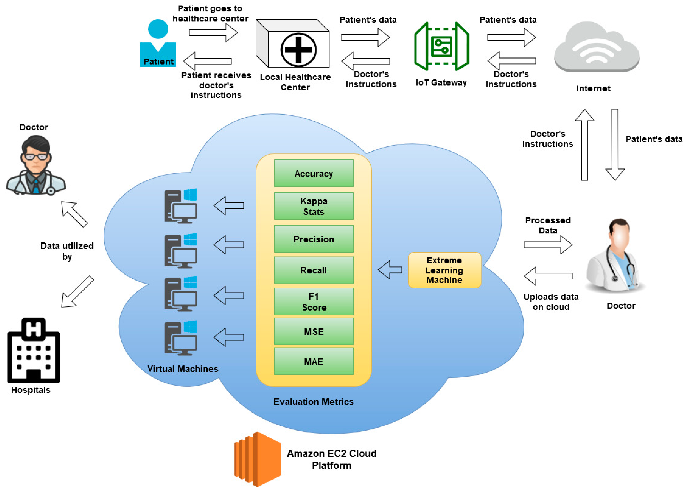

# **Cloud Computing-Based Framework for Breast Cancer Diagnosis Using Extreme Learning Machine**

Lately, I've been interested in new apps about new methods of diagnosis based on big models which need huge resources. One of them was about detecting breast cancer, and they implemented the application on and AWS EC2 instance.

## The Setup: ELM meets Amazon EC2

The researchers used an Extreme Learning Machine (ELM) to classify patient data as "cancerous" or "noncancerous". But instead of just stopping at a local script, they pushed the whole pipeline to an Amazon EC2 cloud environment. 

The workflow they designed is practical for telehealth:
1. A patient in a remote area gets their data collected at a local center.
2. The data hits an IoT gateway and is forwarded to a specialist doctor.
3. The doctor pushes the data into the cloud platform for heavy lifting.
4. In the cloud, the system runs a Gain Ratio feature selection to drop irrelevant noise, and then the ELM model generates a diagnosis.

The architecture of the system is as follows:

## Throwing Hardware at the Problem

Firstly, the problem was tested on an standalone system, and after selecting the best model, the ELM, they implemented it on cloud with different configurations.

Here is a quick breakdown of how bumping up the resources impacted their top accuracy (specifically when running 250 hidden nodes):

| vCPUs | RAM (GB) | Top Accuracy |
| :--- | :--- | :--- |
| 4 | 16 | 0.9648 |
| 8 | 32 | 0.9758 |
| 16 | 64 | 0.9824 |
| 36 | 60 | 0.9868 |

## Why Bother with the Cloud?
>[!TIP]
> **Note on Performance:** You might wonder if network overhead makes cloud deployment slower. Actually, because the cloud has resources in bulk, the execution time for the model dropped from 3.35 seconds on a standalone computer down to just 2.81 seconds in the cloud.

As the table shows, the use of more resources on cloud improved a little bit the final result. All the benefits of the cloud with the fact that the precision and computation time improved, made them stick to this approach.
This will also allow them to scale the system in the future, implementing better models, with more features and options, and this architecture will make it easy to deploy.

## Reference
Lahoura, V., Singh, H., Aggarwal, A., Sharma, B., Mohammed, M. A., Damaševičius, R., Kadry, S., & Cengiz, K. (2021). Cloud Computing-Based Framework for Breast Cancer Diagnosis Using Extreme Learning Machine. Diagnostics, 11(2), 241. https://doi.org/10.3390/diagnostics11020241
